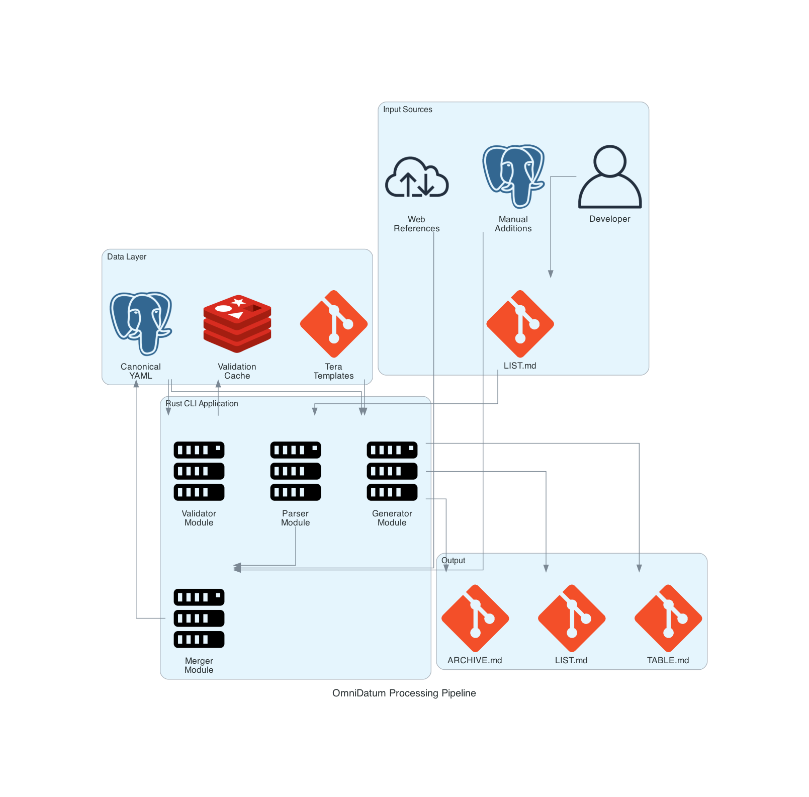
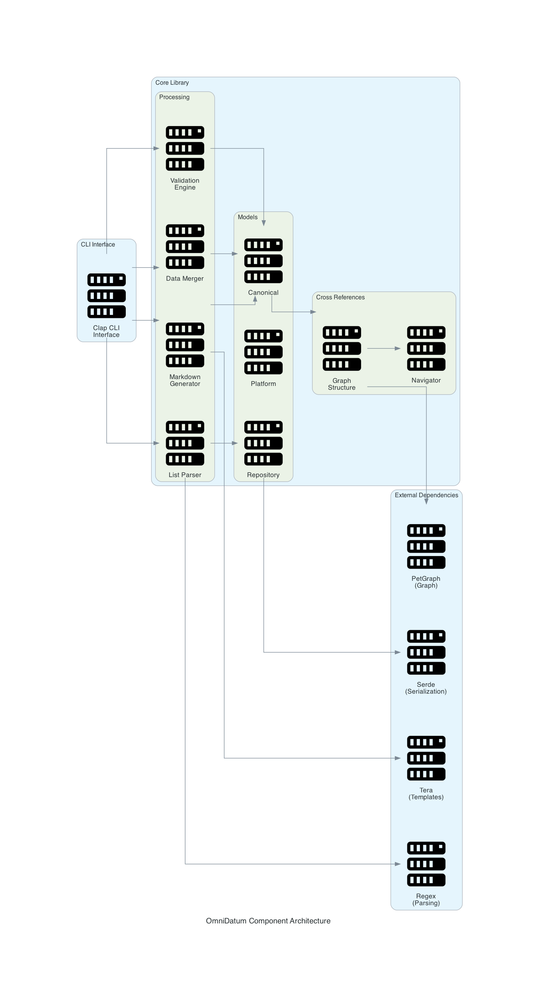

# OmniDatum

A high-performance Rust CLI tool for managing and synchronizing GitHub starred repository documentation across multiple formats.

## Overview

OmniDatum transforms scattered GitHub repository data into organized, validated, and synchronized documentation formats. It processes 800+ repositories in under 300ms, providing automated validation, cross-reference tracking, and multi-format output generation.

**Technology Stack:** Rust 2021, Clap CLI, Tera Templates, PetGraph, YAML/JSON processing

## Features

- **Multi-Format Generation**: Automatically generates LIST.md, TABLE.md, and ARCHIVE.md from canonical data
- **Data Validation**: 7 built-in validation rules with extensible framework  
- **Cross-Reference Tracking**: Bidirectional relationship graph between repositories and documentation
- **Archive Management**: Intelligent separation of active and archived repositories
- **Platform Migration Detection**: Tracks repository moves across GitHub, Codeberg, and other platforms
- **Quality Scoring**: Automated quality assessment based on stars, activity, and metadata
- **Performance Optimized**: Processes 845 repositories in ~280ms

## Prerequisites

### Development Environment

- **Rust**: 1.70+ (2021 edition)
- **Cargo**: Latest stable version
- **Git**: For repository management

```bash
# Install Rust via rustup
curl --proto '=https' --tlsv1.2 -sSf https://sh.rustup.rs | sh
rustc --version && cargo --version
```

## Architecture Diagram





## Project Components

### Core Modules (`src/`)
- **Models** (`src/models/`): Repository, platform, canonical data structures (1,335 lines)
- **Validators** (`src/validators/`): Quality assurance with 7 built-in rules (582 lines)  
- **Parsers** (`src/parsers/`): Markdown parsing with regex extraction (165 lines)
- **Generators** (`src/generators/`): Template-based output generation (181 lines)
- **Cross-References** (`src/cross_refs/`): Graph-based relationship tracking (410 lines)

### CLI Commands
```bash
cargo run -- parse     # Extract from LIST.md to YAML
cargo run -- merge     # Combine multiple data sources  
cargo run -- validate  # Quality checks (7 rules)
cargo run -- generate  # Create markdown outputs
cargo run -- stats     # Display analytics
```

## Next Steps

### Quick Start
```bash
git clone <repository-url> && cd omnidatum
cargo build --release
./target/release/omnidatum-processor generate
```

### Enhancements
- GitHub API integration for real-time updates
- Web interface with REST API
- Plugin system for custom validation rules

## Clean Up

```bash
cargo clean                    # Remove build artifacts
rm -rf data/cache/            # Remove validation cache
rm -f LIST.md TABLE.md        # Remove generated files (optional)
```

## Troubleshooting

**Build Issues**: `rustup update && cargo clean && cargo build`
**Validation Errors**: `RUST_LOG=debug cargo run -- validate`
**Template Issues**: Check `data/templates/` directory exists

### Error Codes
- **E001**: Duplicate repository URLs
- **E002**: Missing license information  
- **E003**: Invalid URL format
- **E004-E007**: Cross-reference, migration, metadata issues

## License

**CC0 1.0 Universal** - Public Domain

[](https://creativecommons.org/publicdomain/zero/1.0/)

This work is released to the public domain. See [LICENSE](../LICENSE) for details.
